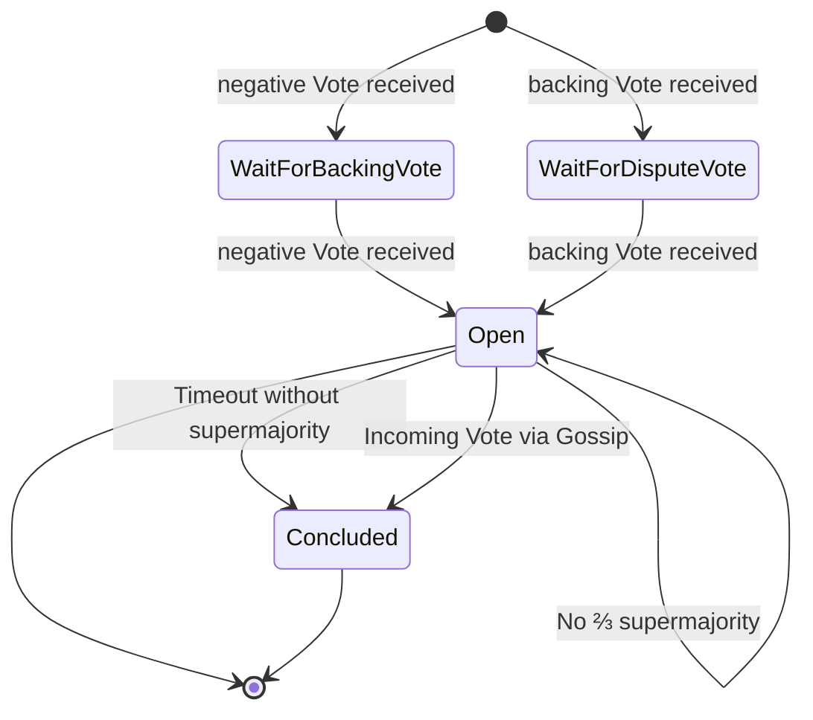
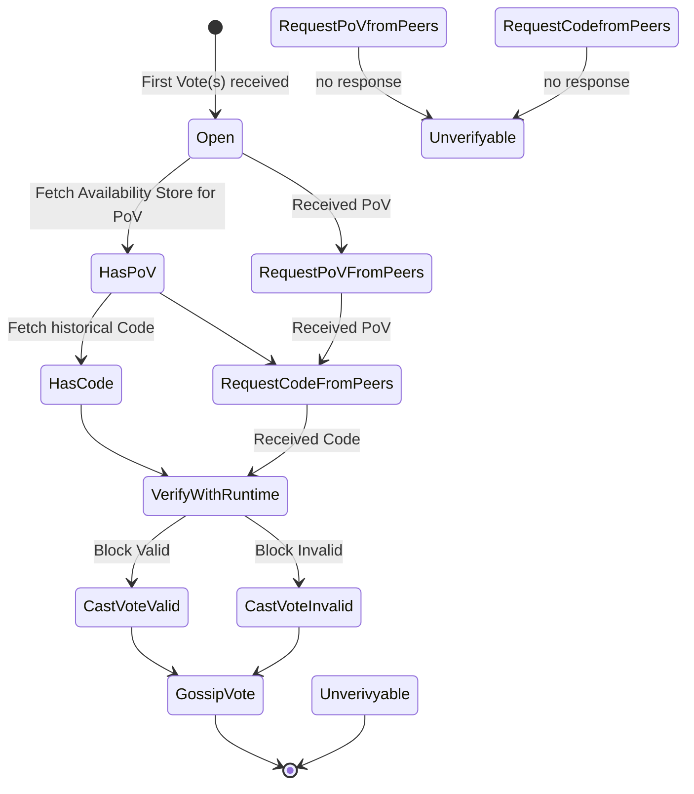

# Disputes Flows

A component-free description in what-if form with addition state graphs of the dispute.

---

---

## Conditional formulation

The set of validators eligible to vote consists of
the validators that had duty at the time of backing, plus backing votes by the backing validators.

Make an availability assurance gossip stage containing PoV, Validation Code, and all votes that are already known.

If a validator receives an initial dispute message (a set of votes where there are at least two opposing votes contained), and the PoV or Code are hence not reconstructable from local storage, that validator must request the required data from its peers.

Remote disputes are disputes that are in relation to a chain that is not part of the local active heads.

All incoming votes must be persisted.

Persisted votes stay persisted for `N` sessions.

If there exists a negative and a positive fork for a particular block, a dispute is detected.

If a dispute is detected, all currently available votes for that block must be gossiped.

If an incoming dispute vote is detected, a validator must cast their own vote. The vote is determined by validating the PoV with the Code at the time of backing the block in question.

If the validator was also a backer of the block, validation and casting an additional vote should be skipped.

If the count of votes pro or cons regarding the disputed block, reaches the required ⅔ supermajority (including the backing votes), the conclusion must be recorded on chain and the voters on the loosing and no-shows being slashed appropriately.

If a block is found invalid by a dispute resolutio, it must be blacklisted to avoid resync.

If a vote is received, after the dispute is resolved, the vote shall still be recorded, albeit with less reward.

If a new active head/chain appears, and the dispute resolution was not recorded on that chain yet, the dispute resolution or open dispute must be recorded / transplanted to that chain as well, since the disputes must be present on all chains to make sure the offender is punished.
